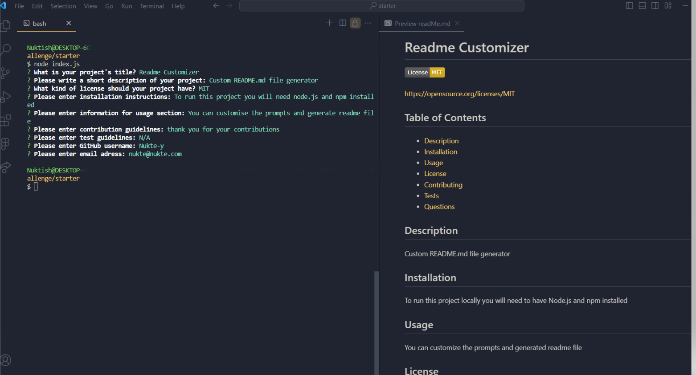

# README Customizer
Custom README.md file generator

## Table of Contents
- [Description](#description)
- [Usage](#usage)
- [Screenshots](#screenshots)
- [Video Demonstration](#video-demonstration)
- [GitHub Repository](#github-repository)
- [License](#license)

## Description
This project is a command-line application that generates professional README files for your projects. It simplifies the process by prompting the user for information about the project and then dynamically creates a README.md file based on the responses.

## Usage
To use the application, follow these steps:

1. Run the command `node index.js`.
2. Follow the prompts to input information about your project.
3. Once all prompts are completed, the README.md file will be generated in the current directory.

## Screenshots

## Video Demonstration
[Watch a demonstration of the application](./assets/README-generator-demoVideo.mp4)

## GitHub Repository
Github: **[Nukte-Y](https://github.com/Nukte-y/ReadmeCustomizer)**

## License
This project is licensed under the terms of the [MIT License](LICENSE).

